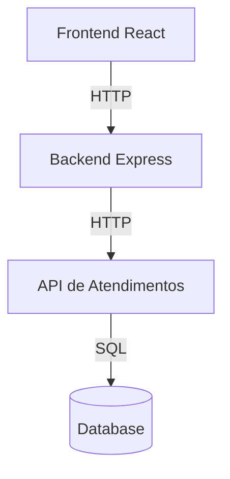

# 🏗️ Arquitetura

## Visão Geral

O projeto é composto por três componentes principais que se comunicam via HTTP:



## Componentes

### Frontend (React/Vite)

- Interface de chat simples e responsiva
- Comunicação com backend via REST
- Styled com CSS modules
- Gerenciamento de estado local

Localização: `chatbot-sut/frontend/`

### Backend (Express)

- Processamento de mensagens
- Validação de entrada
- Integração com API de atendimentos
- Respostas padronizadas

Localização: `chatbot-sut/backend/`

### API de Atendimentos (Express)

- CRUD de tickets
- Suporte a SQLite/Postgres
- Testes de integração
- Documentação OpenAPI

Localização: `atendimentos-api/`

## Fluxo de Dados

1. **Abertura de Atendimento**
   ```mermaid
   sequenceDiagram
       Frontend->>Backend: POST /api/message
       Note over Backend: Valida formato
       Backend->>API: POST /atendimentos
       API->>Database: INSERT
       API->>Backend: ID do ticket
       Backend->>Frontend: Confirmação
   ```

2. **Consulta de Status**
   ```mermaid
   sequenceDiagram
       Frontend->>Backend: POST /api/message
       Note over Backend: Extrai ID
       Backend->>API: GET /atendimentos/{id}
       API->>Database: SELECT
       API->>Backend: Dados do ticket
       Backend->>Frontend: Status formatado
   ```

## Estrutura de Diretórios

```
qa-chatbot-e2e/
├── chatbot-sut/
│   ├── backend/
│   │   ├── src/
│   │   └── tests/
│   ├── frontend/
│   │   ├── src/
│   │   └── tests/
│   └── cypress/
│       ├── e2e/
│       └── support/
├── atendimentos-api/
│   ├── src/
│   └── test/
└── docs/
```

## Design Patterns

- **Repository Pattern** na API de atendimentos
- **Strategy Pattern** para diferentes bancos de dados
- **Dependency Injection** para testabilidade
- **Adapter Pattern** na camada de comunicação